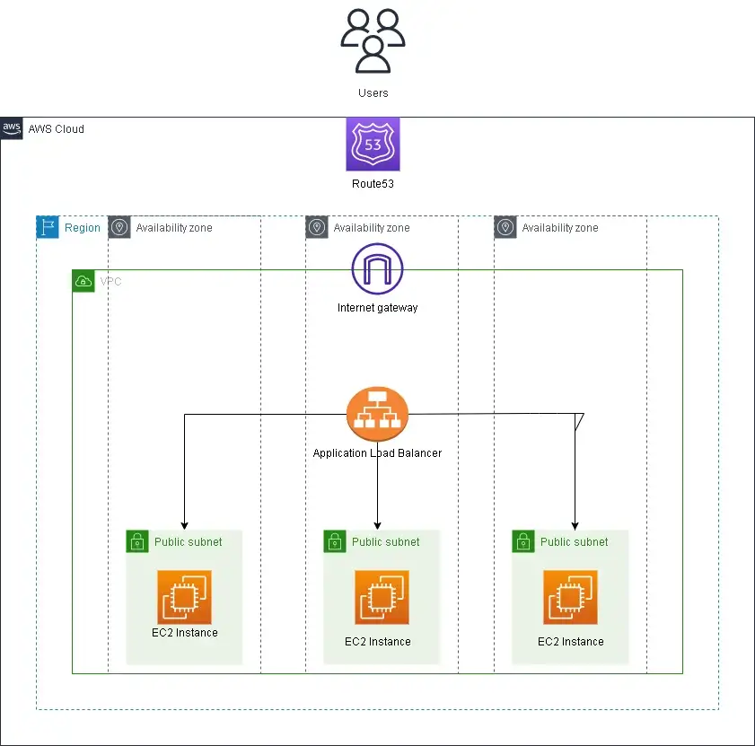

# AltSchool Terraform Project

## Automating Infrastructure Deployment and Configuration Management with Terraform and Ansible on AWS.

- Create a VPC and three EC2 instances and put them behind an Application Load Balancer using Terraform
- Export the public IP addresses of the instances to a file called host-inventory
- Use AWS Route53 to set up a domain name and an A record for a subdomain that points to the ALB IP address

- Use Ansible to automate the configuration of the servers, including: Installing Apache, setting the time zone to Africa/Lagos, and displaying a simple HTML page that can be used to identify the servers.
